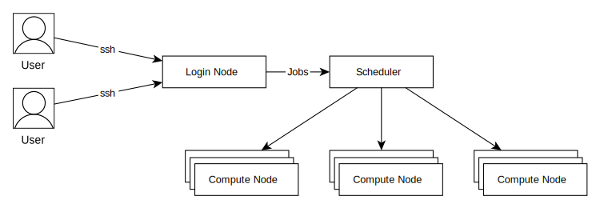

### 作业调度系统介绍


<Highlight2 color="red" bold>登录集群后, 不能直接在登录节点运行程序</Highlight2>
需要通过调度系统以<Highlight2 color="red">作业的形式</Highlight2>提交到计算节点上计算

集群采用slurm调度系统



1. **作业几个重要属性**

   **账户(Account):**

   登录集群用的用户名是上机账号，每个上机账号至少关联一个缴费账户，用于作业计费，
   通常情况下，提交作业不需要指定账户，通过以下命令可以查询上机账号所关联的账户：

   ```shell:no-line-numbers
   sacctmgr show ass user=`whoami` format=account%15 |uniq
   ```
   如果一个上机账号对应了多个缴费账户，那么可以在提交作业时指定缴费账户

   账户主要用作记费, 小型集群一般不会配置记费功能。

   **分区(Partition): 也叫队列**

   提交作业时 ``必须`` 指定分区, 不指定会使用缺省分区，每个分区有不同的属性，比如节点核心数，内存大小，
   通过以下命令可以查看对应集群可用分区；

   ```shell:no-line-numbers
   sacctmgr show ass user=`whoami` format=part |uniq
   或
   sinfo
   ```

   **作业质量(QOS):**

   对于收费集群，用户需要指定QOS，不同QOS优先级不同，收费也不同，

   通过以下命令可以查询 每个用户在每个分区下可用的QOS；

   ```shell:no-number-lines
   sacctmgr show ass user=`whoami`  format=user,part,qos
   ```

   通过下面命令可以查看不同QOS的作业优先级、作业允许最大运行时间、每个用户最多可提交作业数、最多可用核心数。

   ```shell:no-number-lines
   sacctmgr show qos format=name,Priority,MaxWall,MaxJobsPU,MaxTRESPA
   ```

2. **作业调度系统常见的几个指令**

    - [sbatch:提交作业](sbatch.md)
    - [scancel:取消已经提交的作业](scancel.md)
    - [squeue:查看已经提交的作业](squeue.md)
    - [sinfo:查看分区状态](sinfo.md)
    - [salloc:交互运行作业](salloc.md)
    - [查看作业具体信息](scontrol.md)
