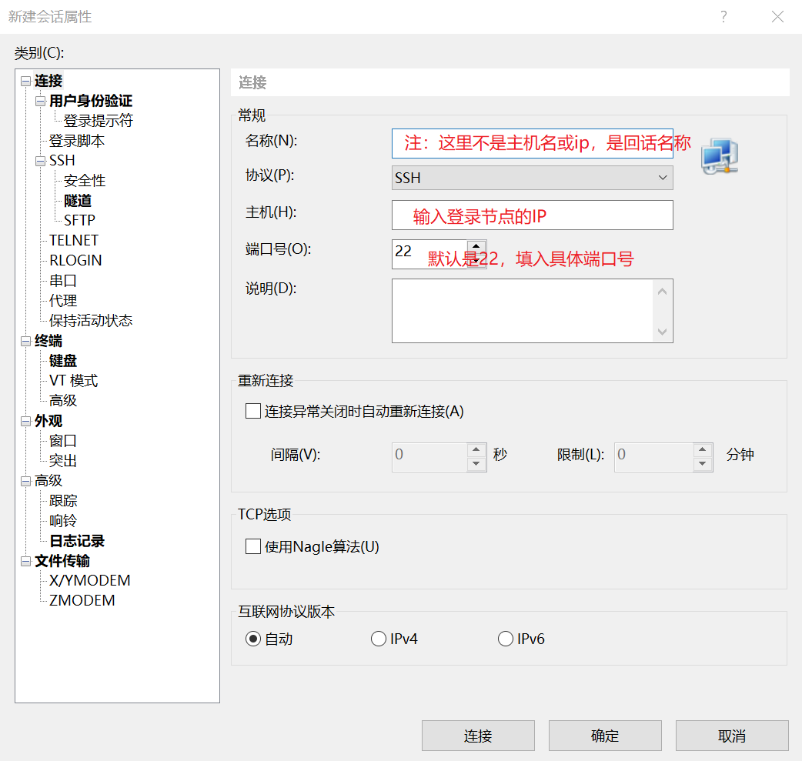
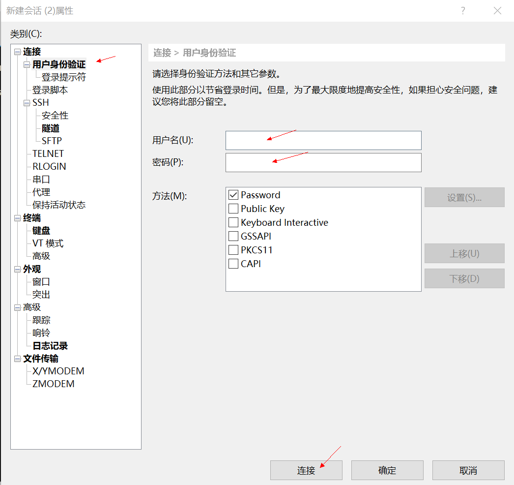
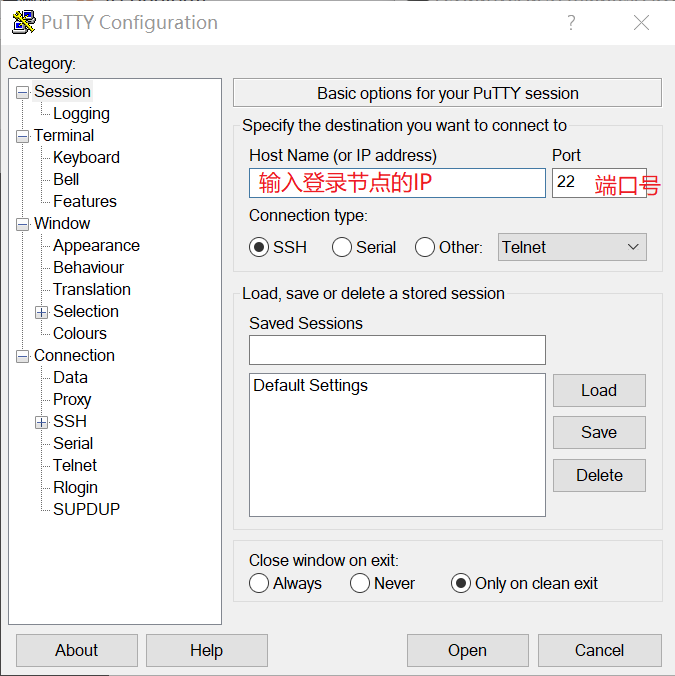

# ssh 方式登录集群

### 集群IP地址

:::tip ssh 入口地址端口号

ip 地址: 172.16.8.200

端口号: 2277
:::

### Linux/Mac用户登录

打开终端后通过以下命令连接，连接前请确保在园区网内，园区外需要连接VPN

```:no-line-numbers
# user_name 为用户名，ip_address 为所要连接集群的IP, port 为端口号
ssh user_name@ip_address -p port
```

### Windows用户登录

``连接前请确保在园区网内，园区外需要连接VPN``

**以xshell客户端为例:**

- **Step 1. 点击 xshell 左上角 ``文件`` 按钮，点击 ``新建``**

    

    - 会话名称输入我们方便识别的即可.

    - 主机输入: 172.16.8.200

    - 端口号修改为: 2277

- **Step 2. 点击 ``用户身份验证``, 输入在登录节点中的账号和密码**

    

- **Step 3. 点击 ``连接`` 即可登录集群, 下次登录时只需点击左上角文件打开该连接即可**

**以 putty 客户端为例:**

- 打开 putty 后, 输入ip地址, 和端口号

    

    - 弹出安全对话框, 这里选接受即可

    - 根据提示, 输入 用户名 和 密码 即可登录

    - 注: ``输入密码，窗口没有回显是正常的，输完直接回车即可``
